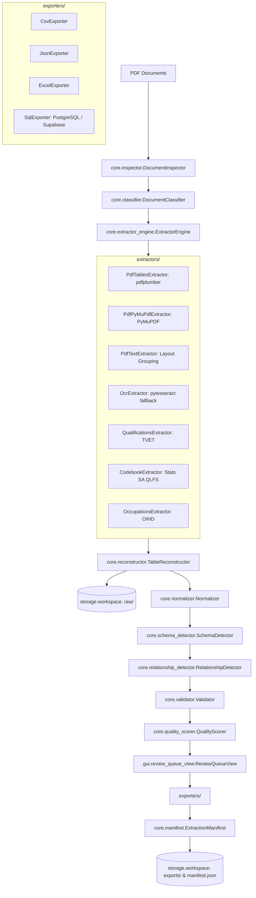

# Darkroom DataForge: Architecture Specification

## 1. Architectural Principles

Darkroom DataForge is designed as a document intelligence and data engineering workstation rather than a generic converter. The platform adheres to the following core tenets:

1. **Dual-Value Provenance Tracking**: Every cell records its `raw_value` as extracted from the PDF, along with its `normalized_value`. Source values are never silently overwritten.
2. **Deterministic & Auditable Pipelines**: Every execution creates an immutable `manifest.json` recording pipeline version, source document hashes, extracted record counts, validation metrics, and method metadata.
3. **Decoupled Extraction Strategies**: The engine decouples table detection, extraction algorithms, normalization logic, and schema generation into independent, pluggable components.
4. **Relational Decomposition**: Tables with multi-valued cells are normalized into parent entities and 1:N relational tables to ensure direct compatibility with PostgreSQL and Supabase without nested delimiters.
5. **Human-in-the-Loop Verification**: Low-confidence extractions and schema anomalies trigger operator review queues with bi-directional navigation to the exact source PDF page.

---

## 2. Component Diagram



---

## 3. Storage Hierarchy & Portability

Projects are strictly local, portable, and require no database daemon to run:

```
dataforge_projects/
└── <project_name>/
    ├── project.json            # Project metadata, document catalog, configuration
    ├── documents/              # Immutable copies of imported source PDFs
    ├── raw/                    # Raw JSON extraction dumps before normalization
    ├── extracted/              # Intermediate extracted tables and column coordinates
    ├── datasets/               # Serialized Pydantic Dataset JSON models
    ├── validation/             # Validation issue reports and auto-fix logs
    ├── exports/                # Exported CSV, JSON, XLSX, and schema.sql files
    ├── logs/                   # Structured pipeline execution logs
    └── manifest.json           # Comprehensive audit trail and run history
```

Projects can be zipped, moved, or shared across team members' workstations without broken references.
